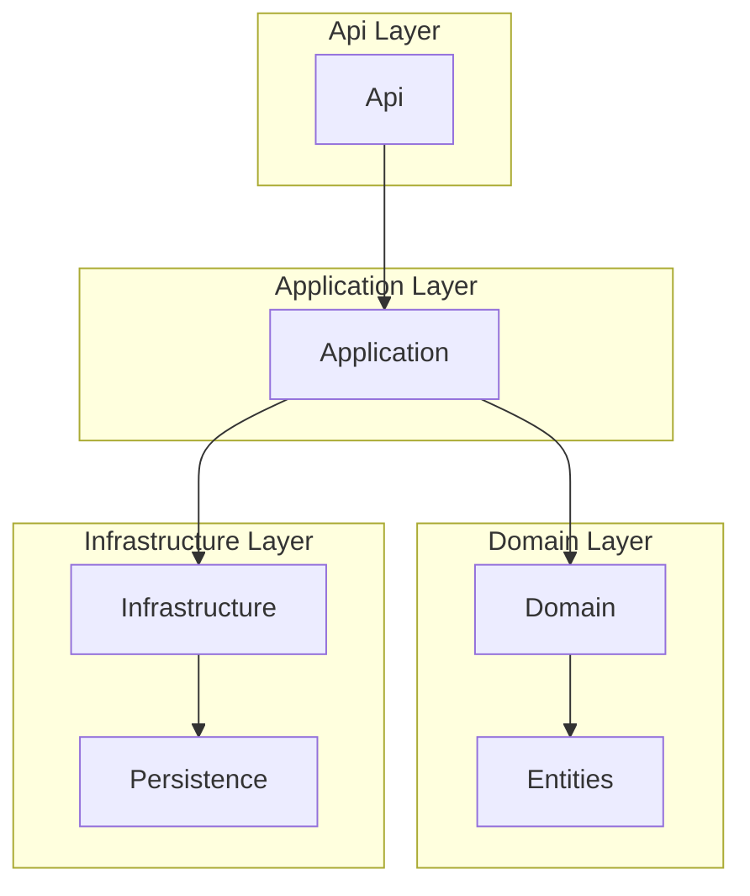

# CRUD Example Project

## 🎯 Goal

This project demonstrates **CRUD operations** using a persistent database and a Web API. Swagger integration is included
for API visualization and manual testing.

## 🛠️ Tech Stack

- **ASP.NET Core**: Framework for building the Web API.
- **PostgreSQL**: Database for persistence.
- **EF Core 9**: Entity Framework Core for ORM functionality.
- **C# 13**: Programming language used for development.
- **.NET 9**: The runtime powering the application.
- **FluentValidation**: Library for building strongly-typed validation rules.

- **xUnit**: Unit testing framework.
- **Moq**: Mocking framework for test isolation.
- **FluentAssertions**: Library for expressive test assertions.
- **TestContainers**: Library for running test dependencies (e.g., databases) in Docker containers.
- **Bogus**: Fake data generator for testing.

## 🗂️ Project Structure

The project adopts a **layered architecture** for better organization, testability, and scalability:

- **Api**: Contains Web API controllers and handles application bootstrap/configuration.
- **Application**: Contains business logic abstractions, including services and data transfer objects (DTOs).
- **Domain**: Defines domain-specific entities and logic.
- **Infrastructure**: Implements persistence, including database configurations and migrations.

### 🧪 Testing

- Each project has a corresponding `*.Tests` project containing **unit tests**.
- **Integration tests** for the API are located in `InventoryManagement.Api.IntegrationTests`.

## 🚀 Future Ideas

1. **🏗️ Architecture Tests (e.g., ArchUnitNET)**  
   Introduce architecture tests to enforce design principles and ensure the application's structure aligns with its
   intended architecture.

2. **📚 Mediator Pattern (CQRS)**  
   Implement the **mediator pattern** for better separation of concerns and support for the **CQRS** (Command Query
   Responsibility Segregation) pattern.

3. **🔮 Adding GraphQL as a Second Web API**  
   While the project currently uses a traditional **RESTful Web API**, adding **GraphQL** as a second API will enhance
   flexibility and provide more efficient querying capabilities.

4. **📱 Implementing .NET MAUI for Cross-Platform UI**  
   **.NET MAUI** (Multi-platform App UI) can be used to create a **cross-platform** application that works across mobile
   and desktop platforms (Android, iOS, macOS, and Windows) using a single codebase.

5. **🔐 Implementing Authentication and Authorization**  
   Introduce authentication and authorization to secure the Web API. This will ensure that only authorized users can
   access specific resources.
